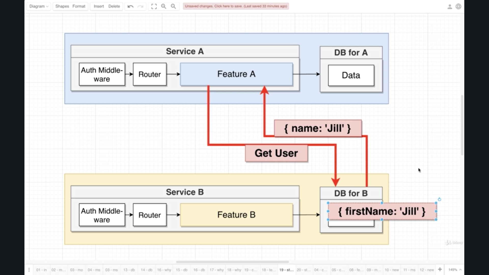
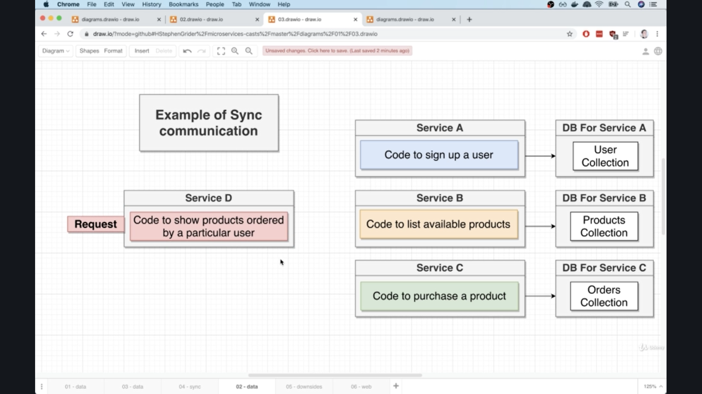
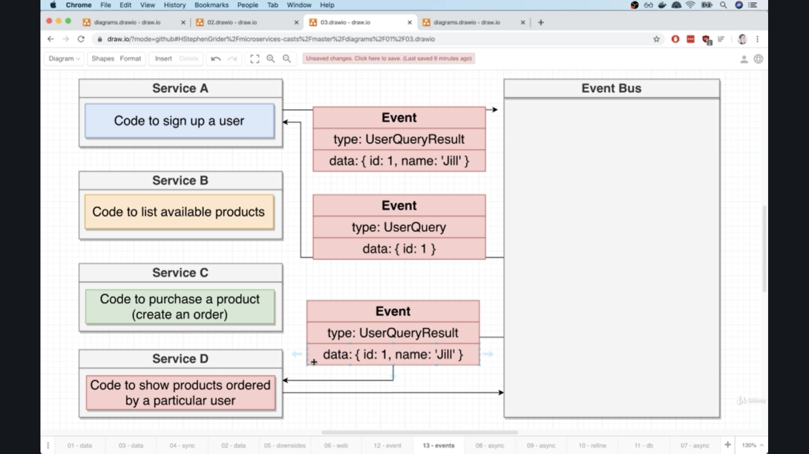
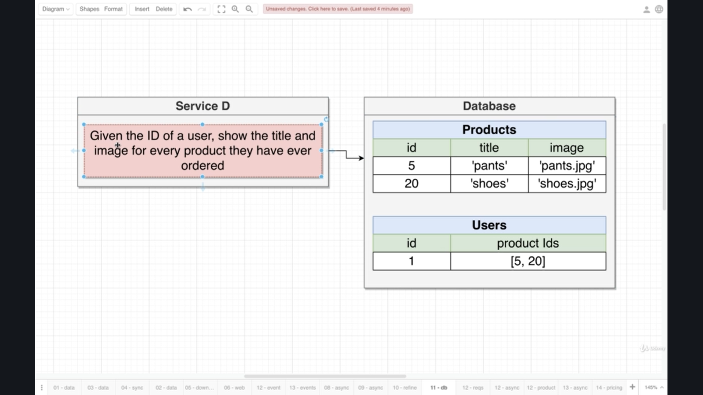
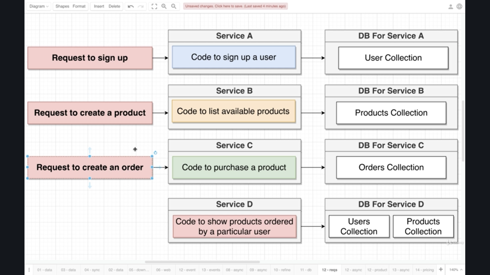
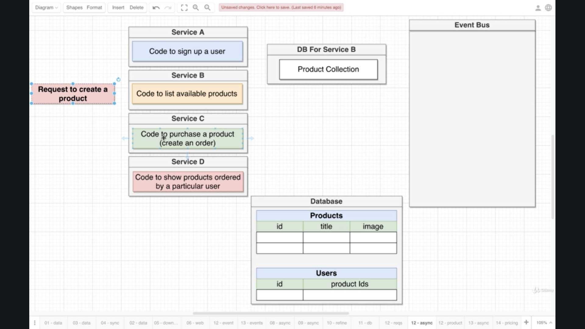
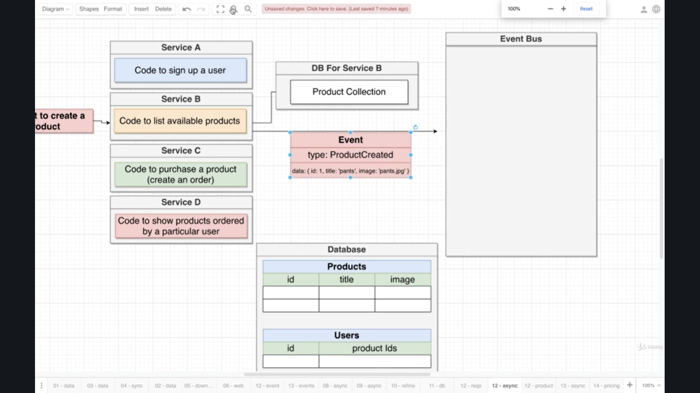
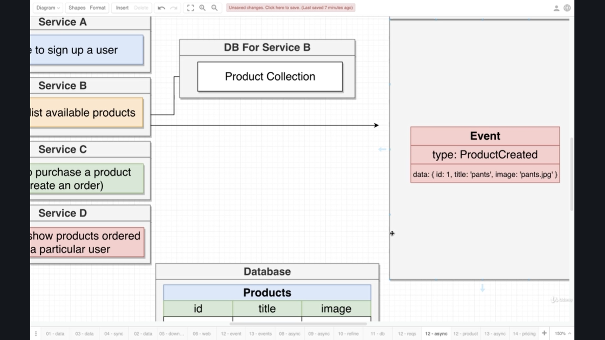
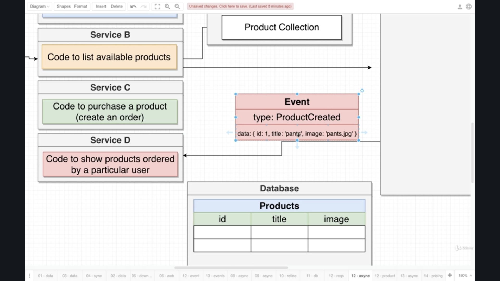

# What is Microservices?


Monolithic = 단단히 짜여 하나로 구성 되어 있음을 의미한다.

1. Request가 user's browser or mobile device를 통해 들어온다.
2. Pre-Processing Middleware로 이 request가 들어온다. 여기서는 주로 Authentication과 관련된 검증을 시행한다.

3. Router - 2단계에서 검증에 통과한 Request는 Router로 들어온다.
4. Feature n - 3단계에서 Request에 해당하는 Router는 해당 url에 대한 controller 혹은 handler를 실행한다.
5. Database - 4단계에서 Feature에 정의된 방식으로 Request로 들어온 데이터를 가공한다.

```javascript
A monolith contains

Router - Middlewares - Business Logic - Database Access

to implement all features of our app

all!
```

```javascript
A single microservices contains

Routing + Middlewares - Business Logic - Database

to implement one feature of our app

one!
```


Microservices에서는 각자 특성화된 서비스에 따른 특정한 routing, middleware, business logic and database를 가지고 있다. 여기서 주목해야 할 점은 각 서비스는 서로에게 완전히 독립적이다 비록 한 프로그램 혹은 App에서 동시에 동작할지라도.

이러한 방식을 취하는 이유는 다음과 같다.

만약 Server B, C, D가 갑자기 고장 났다고 생각해보자. 만약 Service A, B, C, D 모두가 완전히 독립적이지 않고 상호 의존적 관계였다면 한 서비스의 고장이 모든 서비스에 큰 영향을 미칠 수 있다. 하지만 위와 같이 서로에게 완전히 독립적인 방식은 한 서비스가 고장 나도 다른 서비스에 어떠한 영향도 미치지 않기 때문에 고장 난 서비스만 다시 수정해서 서비스를 제공하면 된다.

# Data in Microservices

#### What's the big challenge with microservices?

```javascript
Data Management between services
- This is the big problem of microservices
```

### Why is this such a big thing?

```javascript
With microservices, we store and access data in sort of `strange way`

1. how we store data
2. how we access it
```


Service A, B, C, D 모두가 자기만의 데이터베이스를 가지고 있다고 생각해보자. 그렇다면 어떻게 데이터에 접근해야 할까?


위 사진에 나온 것처럼 다른 서비스가 다른 서비의 데이터베이스에 접근하는 상황이 결코 벌어질 수 없다. 왜 이 구조가 중요한가? 차차 언급하겠다.

```javascript
Each Services gets its own database (if it needs one)

Services will never, ever reach into another services database

// Okay... But Why?
```

### Why Database-Per-Service

1. We want to each service to run independently of other services
2. Database schema/structure might change unexpectedly
3. Some services might function more efficiently with different types of DB's (sql vs nosql)


두 개의 다른 서비스가 같은 데이터베이스를 사용한다고 생각해보자. 어떤 문제가 발생할까?

1. 데이터베이스를 확장할 때 굉장히 복잡해진다.
2. 서비스 둘 중 한 곳에 문제가 생기면 양쪽 모두에 영향을 미친다.


위 사진과 같은 동작이 가능하다면 어떤 문제가 발생할까?

1. 만약 DB for B에서 문제가 발생하면 Feature A 에도 문제가 발생한다 그 이유는 위와 같은 접근은 둘 사이의 Dependency에 문제가 없다는 전제하에 가능하지만 그렇지 않은면 양쪽 모두에 문제가 발생하기 때문이다.



위 사진의 경우 일반적으로 Server A의 Feature A에서 Get User method를 호출할 때 DB for B 데이터베이스를 사용하는데 보통의 경우 `{name: "Jill"}`을 response로 주지만. 만약 DB for B가 name schema 대신에 `firstName` , `lastName` 등의 schema를 추가하는 경우 Service A가 얻고자 하는 데이터인 name이 아니므로 Service A는 firstName을 인식하지 못하고 그에 따라 시스템이 고장 난다. 이러한 문제는 때로는 예측하기가 힘들 수 있기 때문에 위 사진과 같이 서로 다른 서비스가 데이터베이스를 공유하지 않는다.

## Mid-Summary

**Creating one database per service seems like a waste! Why do we create one database per service?**

- We want every service to be able to act independently without depending on any other service
- If each service has its own database, we can optimize what type of database we pick for a service
- A single database shared between many services would be a single point of failure, which would limit the reliability of our app.

**Imagine you are developing a service called ProductService. Your service's goal is to manage all aspects of products sold on your platform.**

**Another engineer who is responsible for a different service comes to you and asks for documentation on how to connect to your services database.**

**How would you respond?**

- I would ask them to find another way to get information out of my service's database.

# Big Problems with Data


Monolithic Style Approach로 Basic Ecommerce App을 생성한다고 생각해보자.


Monolithic Server와 Database 구조는 위 두 사진과 같다.

만약 위 상태에서

```javascript
Code to show products ordered by a particular user 기능을 추가해야 한다고 생각해보자 어떻게 해야할까?

1. 구매내역 추적의 과정에서 User의 존재유무를 확인하기 위해 User Collection을 확인한다.

2. User Collection에서 Valid함이 검증되면 Orders Collection에가서 주문 내역을 확인한다.

3. 마지막으로 구매한 내역의 상품의 정보를 알기위해 Products Collection을 확인한다.

즉 이 하나의 Feature를 구현하기위해 세 종류의 Collection을 모두 확인하고 검증해야한다.
```

Monolithic Server에서 Code to ... 기능을 추가하는 것은 괜찮아 보인다.


그럼 다시 위 사진으로 돌아가서 어떻게 하면 Monolithic Server의 세 기능을 세 가지의 다른 Microservices로 구현할 수 있을까?


위와 같이 Monolithic --> Microservices로 구성할 수 있다.


만약 Service D 기능을 추가하면 위와 같은 모습으로 A, B, C의 데이터베이스에 모두 접근할 수 있어야 하는데 이것은 Microservices의 철학과는 어긋나는 방식이다.

그렇다면 어떻게 ServiceD를 만들어야 할까?

나도 잘 모르겠다. 그래서 Data Management between services가 굉장히 어려운 것이다.

## Sync Communication Between Services


위 사진의 문제를 해결하기 위한 큰 범주의 두 가지 방식을 소개하자면 아래와 같다.

```javascript
Communication Strategies Between Services

          Sync      Async

These words don't mean what they mean in JavaScript world!!!
```

##### Sync

- Services communicate with each other using direct requests

##### Async

- Services communicate with each other using events



1. Request comes in Service D - **Show me all the products ordered by a particular user**

2. Service D makes direct request over to service A (plain HTTP request or exchange JSON, etc). Then Service D makes sure that the user exists and response back to Service D.
3. Service D makes direct request to service C and find all the orders ordered by a particular user. Service D gets back response from Service C.
4. Service D makes direct request to service B like giving me details of this products. Then Service D gets back response from Service D.
5. Finally Service D has all the information to response the request - **Show me all the products ordered by a particular user**.

주목할 점은 Service D는 Service A, B, C의 데이터베이스에 직접 접근 하지 않고 요청에 응답을 위한 데이터를 수집했다. 즉 이것은 microservices의 rule of thumbs를 어기지 않음을 의미한다.

### Notes on Sync Communication

- Conceptually easy to understand!
- Service D won't need a database!
- Introduces a dependency between services
- If any inter-service (a or b or c 중 하나가 동작하지 않는 경우) request fails, the overall request fails
- The entire request is only as fast as the slowest request
  - D --> A: 1초 D --> C: 1초 D --> B: 1초 ---> 아무리 빨라도 3초
- Can easily introduce webs of request


Microservice에서는 자기가 다루는 서비스를 제외하고는 다른 서비스가 내부적으로 어떻게 동작하는지에 관해 크게 알 필요가 없다. 물론 많이 알면 많이 알수록 좋지만.

# Event-Based Communication


모든 서비스가 공통으로 접근할 수 있는 Event Bus가 존재한다. Event Bus의 목적은 각 서비스의 알림을 다루는 것이다. 각 서비스는 이벤트를 Event Bus에 송출할 수 있고 동시에 Event Bus로부터 이벤트를 송출 받을 수 있다. 그리고 공통으로 접근할 수 있는 위치가 하나라는 것은 실패하는 위치 또한 Single Point of Failure


Service D가 request를 받고 이 요청을 완수하기 위해서는 위 사진과 같이 이벤트를 Event Bus로 송출하는 것이다. 


Service D가 송출한 Event를 받은 Event Bus는 정의한 로직에 따라 특정한 유저의 정보를 찾기 위해 Service A로 이벤트를 송출한다. 


Event Bus가 송출한 이벤트가 Service A로 전달되고 Service A는 해당 이벤트에 대한 동작을 처리한다.


Event Bus 부터 받은 이벤트에 대한 동작을 처리한 Service A는 해당 결과값을 Event Bus로 이벤트를 송출해 전달한다.


Event Bus는 Service A로 부터 이벤트를 받고 해당 결과값을 요청을 보낸 Service D로 다시 돌려보내 준다. 


결과적으로 Event Bus는 Microservice로 독립된 서비스들이 서로 의사소통 할 수 있게 도와주는 중개자 역할을 한다.

위와 같은 구조를 자주 못 보는 이유는 다음과 같다

- Conceptually not easy to understand
- dependency problems between services
- timeout 등등 복잡한 문제가 발생한다

# A Crazy Way of Storing Data

#### Just like the database-per-service pattern, async communication is going to seem bizarre and inefficient.


```javascript
--------------------------------
          Service D
--------------------------------
  Code to show products ordered 
     by a particular user
---------------------------------  
```

ServiceD의 명확한 목적을 다시 정의해보자.



ServiceD의 데이터베이스의 경우 user's email, address, name 등을 신경 쓸 필요가 없다. ServiceD에 필요한 것은 User's id이다. 



만약 Request to sign up이 ServiceA에 발생하자마자 ServiceD에 전달하라고 로직을 작성하면 rule of thumb of microservices에서 벗어나게 된다. 왜냐하면 Dependency 문제가 생겨서 두 서비스 중 한 곳만 문제가 생겨도 양쪽에 영향을 미치기 때문이다. 

이 문제를 Async Communication 방식으로 접근해보자.



언제든 Service A, B, or C에 Request to create a product이 발생했을 때 Service A, B, or C는 자신에게 발생한 이벤트를 Event Bus로 송출해줘야 한다. 



위 사진을 보면 ServiceB에 요청이 발생했고 그것에 따라 DB For Service B에 들어온  요청을 처리하고 동시에 Service B에서 일어난 동작에 관한 결과값을 실은 Event가 Event Bus로 동시에 송출되게 된다. 송출하는 데이터에는 새로 생성된 혹은 갱신된 혹은 삭제된 데이터 등이 담겨있을 수 있다.



Event Bus에 ServiceB에서 일어난 일에 대한 데이터가 동작하고 그 후 해당 데이터에 관심이 있는 Service에게 Event Bus가 해당 Event를 다시 송출해준다.



Event Bus는 ServiceB 에서 발생한 결과값을 ServiceD에게 전달되고 ServiceD는 아래와 같이 ServiceD가 사용하고 있는 Database를 갱신한다.

**Request --> Service B --> DB For Service B--> Event Bus --> Service D --> Database**

Database

##### Products

| id  | title   | image       |
| --- | ------- | ----------- |
| 1   | 'pants' | 'pants.jpg' |
|     |         |             |

위 상황과 동일하게 Request to Signup이 들어오고 해당 요청이 Service A로 전달되고 Service A는 DB For Service A에 방문해 요청에 따른 동작을 진행하고 해당 동작을 Event Bus에 송출한다. 그리고 Event Bus는 Service A에서 이벤트를 처리한 후 리턴한 값에 관심이 있는 Service에 해당 리턴값을 전달해준다.  

위 상황과 같이 Service A에서 Event Bus로 송출한 데이터를 Event Bus가 받아 그것을 Service D에게 전달한다. 그렇게 되면 Service D의 Database는 아래와 같이 갱신된다.

**Request --> Service A --> DB For Service A--> Event Bus --> Service A --> Database**

Database

##### Products

| id  | title   | image       |
| --- | ------- | ----------- |
| 1   | 'pants' | 'pants.jpg' |
|     |         |             |

##### Users

| id  | product Ids |
| --- | ----------- |
| 1   | []          |

마지막으로 Request to order a product이 발생하면 이 요청은 Service C로 가고 그 후 DB For Service C에 새로운 제품 주문 데이터가 갱신되고 갱신한 결과를 리턴한 값을 Event Bus로 송출해준다. 그 이후 Event Bus에서 그 값을 가지고 있다가 이 값에 관심이 있는 Service D에게 이 값을 담은 Event를 다시 송출해준다. 결과적으로 Service D의 데이터베이스는 아래와 같이 형성된다.

**Request --> Service C --> DB For Service C--> Event Bus --> Service D --> Database**

#### Database For Service D

##### Products

| id  | title   | image       |
| --- | ------- | ----------- |
| 1   | 'pants' | 'pants.jpg' |
|     |         |             |

##### Users

| id  | product Ids |
| --- | ----------- |
| 1   | [1]         |

## Pros and Cons of Async Communication

### Nots on Async Communication

- **Service D has zero dependencies on other services!** (**Pros**)

  - Service D에 요청이 들어왔을 때 다른 Service에 도달하지 않고 요청을 처리할 수 있다.
  - 만약 Service A, B, and C가 모두 사라지거나 고장 나도 Service D에 유지된 데이터를 기반으로 정상적으로 동작한다.

- **Service D will be extremely fast!** (**Pros**)

  - Service D가 요청을 처리할 때 다른 데이터베이스에서 값을 가져오는 것이 아닌 Service D의 데이터베이스에 갱신된 값을 바로 이용하기 때문이다.

- **Data duplication. Paying for extra storage + extra DB** (**Cons**)
- 데이터 중복의 문제가 발생한다. 그 이유는 Service A, B, and C의 데이터가 Service D의 데이터베이스에 저장되기 때문이다.
  - 아래 사진을 보면 GB당 다양한 Cloud의 가격의 비교를 나타낸 것이다. 아래 작은 글씨의 JSON 데이터의 크기는 얼마나 될까? 1,250 bytes = 1.25 KB = 0.000001 에서 약 백만 개의 데이터를 저장하면 한 달에 청구되는 금액은  약 $14.375이다. 만약 위와 같이 데이터의 중복이 발생하면 적어도 본래의 금액보다 더 많은 금액이 추가로 발생한다.


- **Harder to understand** (**Cons**)
- Event간의 이동을 일일이 추적하기가 힘들다.


## FAQ

**Q**: If Service A sends an event to the Event Bus, does Service A check that the Event Bus sends out the event (proving that it processed it correctly)?

**A**: Yep, events could be lost. There is a pattern mentioned later in the course called the 'transactional outbox'. This pattern helps solve issues around missed events. We don't that pattern in this course, just because it is a little bit too much code to put together.


**Q**: isn't data inconsistency a real possibility as Service D might be down when the event was emitted and hence has inconsistent data.

**A**: Yep, you're correct, service D going down will cause some big issues. This is a big issue that we will tackle later on in the course - the final version of our app will work correctly even if this 'service d' goes down for some amount of time.


**Q**: Specifically in the async architecture we are going to use for the rest of the course.

**A**: 

Stephen please correct me if I'm wrong but isn't one of the things the message bus brings to the table is "eventual guaranteed delivery"? If that's the case, it would never be a single point of failure when used asynchronously. I guess unless one were to completely uninstall the event bus itself.  So you can have several services publishing messages to the bus even if the subscriber(s) are not running, etc.. The messages will just sit there on the queue (for as long as they are valid (ie, timeouts, etc..) waiting for subscribers to come online and get them. As such, not a point of failure.

Since it's async, it's basically a "fire and forget" schema.  If you're able to "fire" the event, that itself is considered a success.

**C**: 

I think Alec is asking about the possibility of the event bus itself going down. In that case, there wouldn't be a 'fire and forget', because the 'fire' part would always be unsuccessful.

Alec - Yes, the event bus is a single point of failure. There are a variety of ways to handle this, the most common of which is to have a level of redundancy around the event bus itself. So, for example, we might run a single 'primary' event bus, with another one or two instances of it in 'standby' mode. If the primary fails for any reason, the other instance can elect itself as the new 'primary' and continue receiving and routing events.

**A**:

I guess in the case where a standby was not available, your microservice could report an error back telling the user to try again later and the rest of the system could still function.  Or you could add your own persistent queuing mechanism to store "unsent fire requests" and leave the transaction in a pending state?

**C**:

Tkousek - Yes! Great intuition. That idea of storing events locally and then emitting them at some point in the future is excellent - this is something called the 'transactional outbox' pattern. It is a pattern used to make sure events do eventually get emitted. We do discuss this pattern much later on in the course.

**A**:

Thank you Stephen & Tkousek. Wanted to make sure I fully understand the system. Y'all have provided a lot of insight. Looking forward to the rest of the course, I've taken many courses and I can feel this is the one I'll learn the most from on Udemy. :D

**C**: 

\> called the 'transactional outbox' pattern.

We used that in our production webapp with an old JS lib called offline.js where we stored pending uploads in localstorage (json) till we were back online again.

I've been fascinated/interested in microservices for 2 years now and took many courses in Udemy/Linux academy/Pluralsight on them/Kubernetes and Docker but my current employer does not seem to want to embrace them so we're still stuck doing monolith on the job mostly. It does not stop me from learning as much about them off hours tho  :-)


**Q**: 

You mention that Data Duplication is a "Con", but don't talk about upgrades and data changes. For example, if the products service gets upgraded and adds a new attribute, the spec for the "show products" service may also change to incorporate that. How will that get impacted in this ?

Also, you talk about storage as the cost, but not of "extra processing". I am assuming you are going with the assumption that the data that comes in from the other service will only be used in the form it came and not additional processing needs to be done. Because, it is very possible, that most of the data stored by Service D may never be read. So, really there should have been no need to "pre-process" the data and keep. Alternatively, if the application has that as the requirement, how would that impact the decisions here ?

**A**:

Very insightful to think about the possibility of version changing over time! That is a topic that gets covered later on. I only didn't mention it here to keep the complexity at a minimum.

Regarding extra processing - the reason I specifically mentioned the cost of storage is that when people think about data replication, they immediately think that it will be cost prohibitive. The discussion of storage cost is in here just to calm that fear.