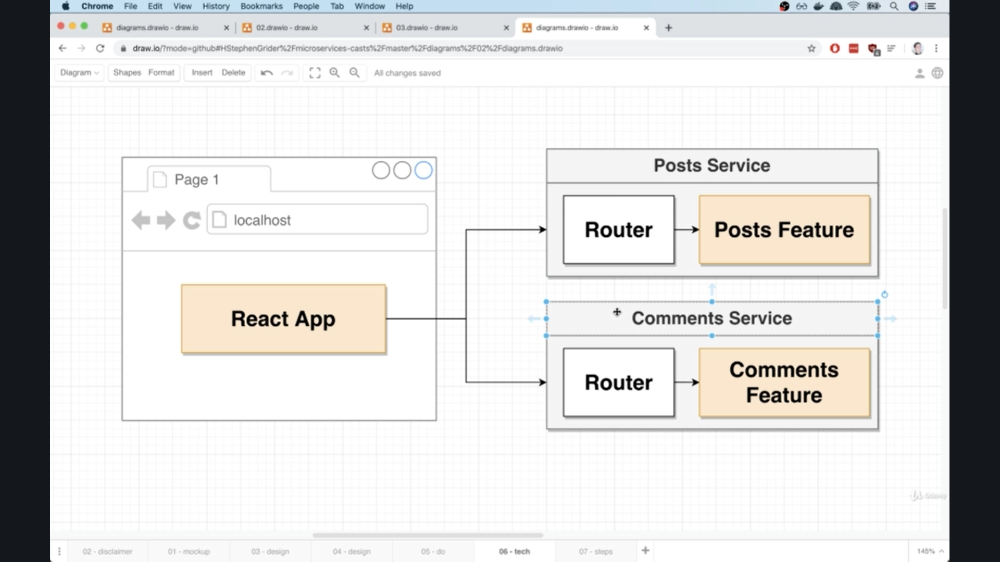
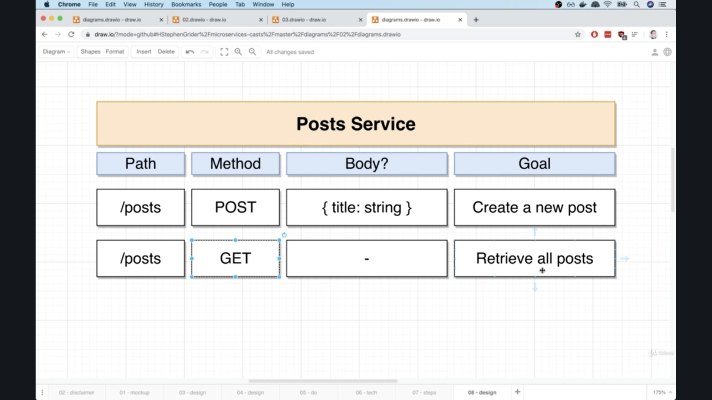
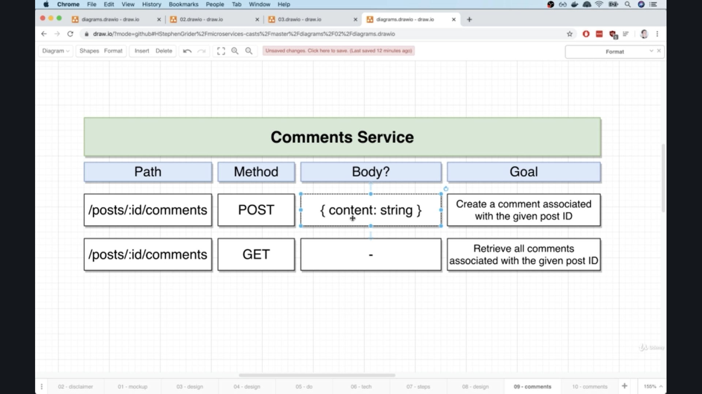
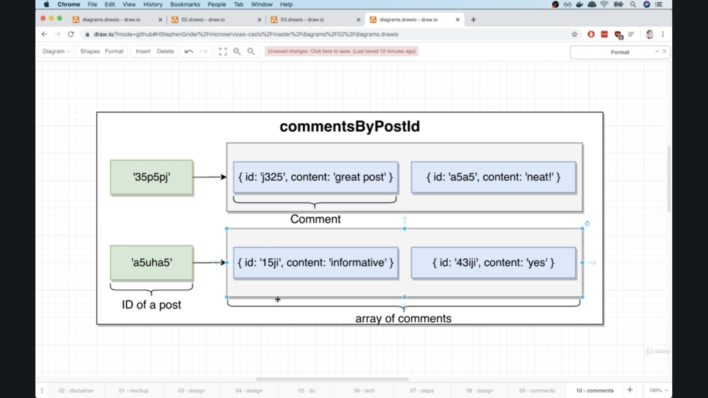
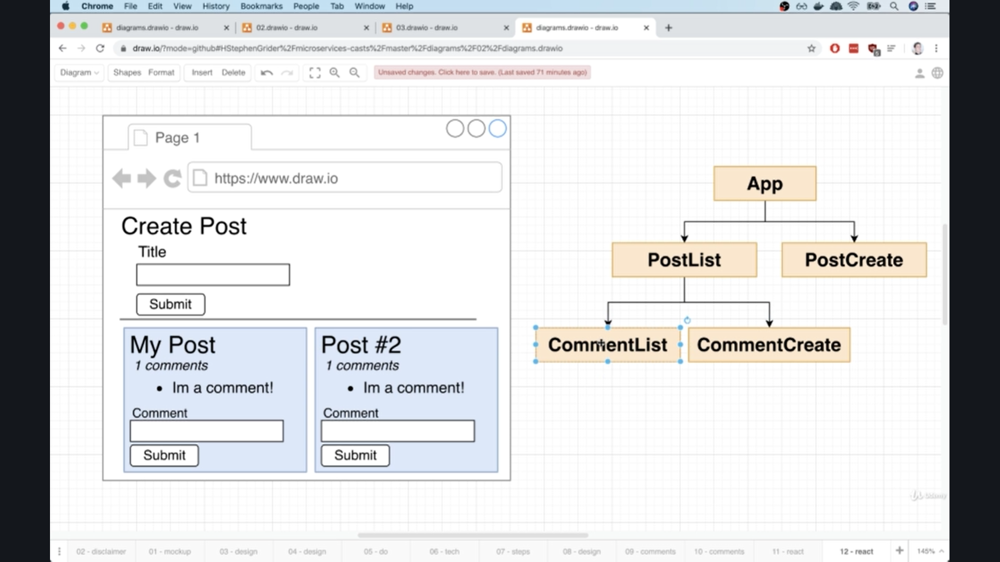

# Mini-Microservice Application

#### Few Notes

1. Goal #1 - Get a taste of a microservices architecture
2. Goal #2 - Build as much as possible from scratch

# What Services should we create?

- For now, we will create one separate service for each resourc in our app.

```javascript
     ----> Create a Post
Posts
     ----> List all Posts


     ----> Create a Comment
Comments
     ----> List all comments
```

# Project Setup



위 사진에서 볼 수 있듯 React App은 Posts Service와 Comments Service와 소통하고 있는 것을 알 수 있다.

### Initial App Setup

- Generate a new React App using Create-React-App
- Create an Express-based project for the **Posts** Service
- Create an Express-based project for the **Comments** Service

```javascript
// blog director

npx create-react-app client

mkdir posts
cd posts
npm init -y
npm i express cors axios nodemon


mkdir comments
cd comments
npm init -y
npm i express cors axios nodemon
```

## Posts Service



## Comments Service





# React Project Setup




