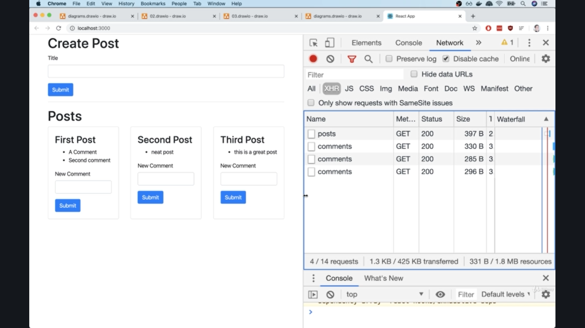
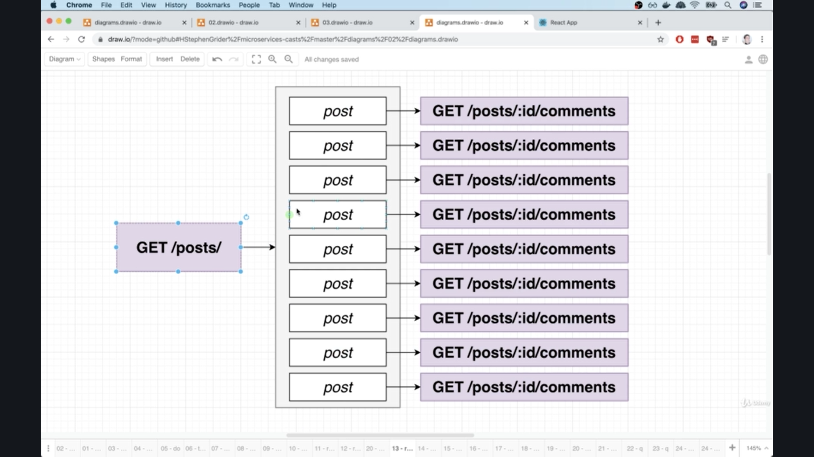
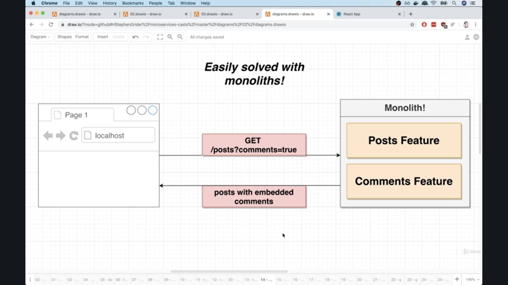
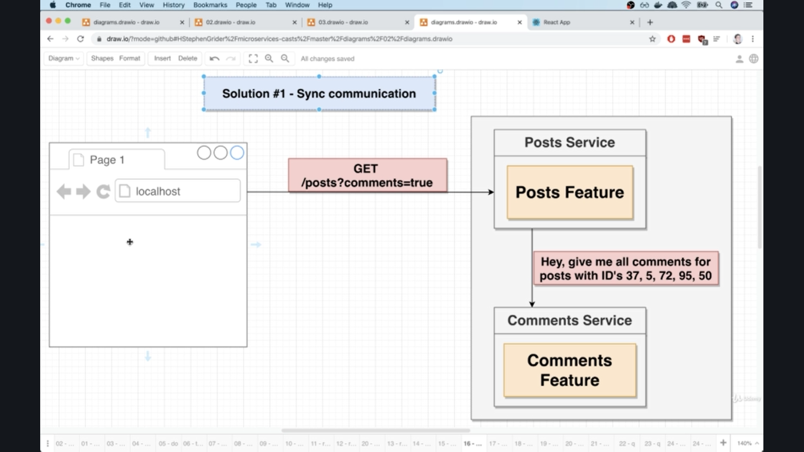
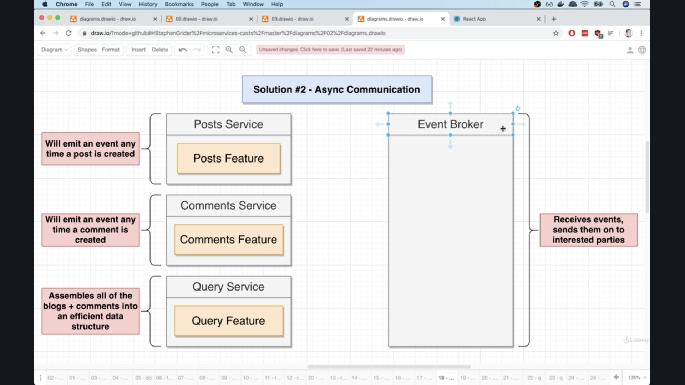
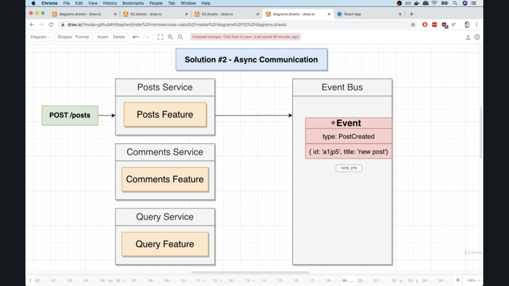
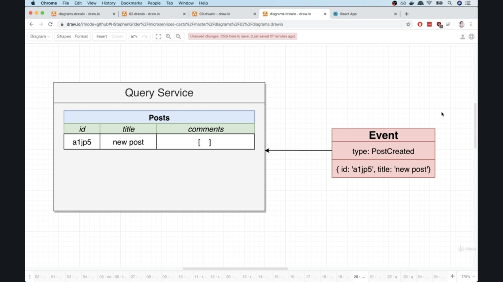
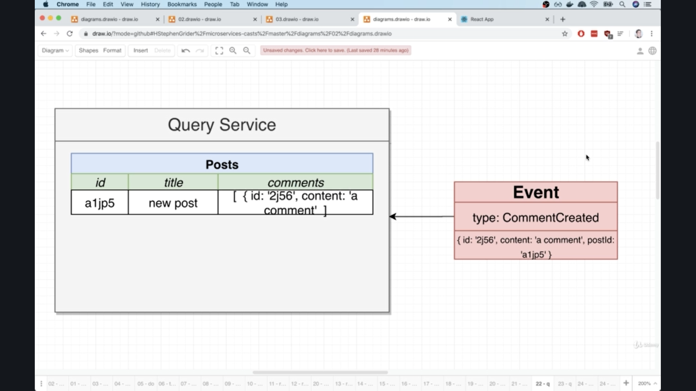
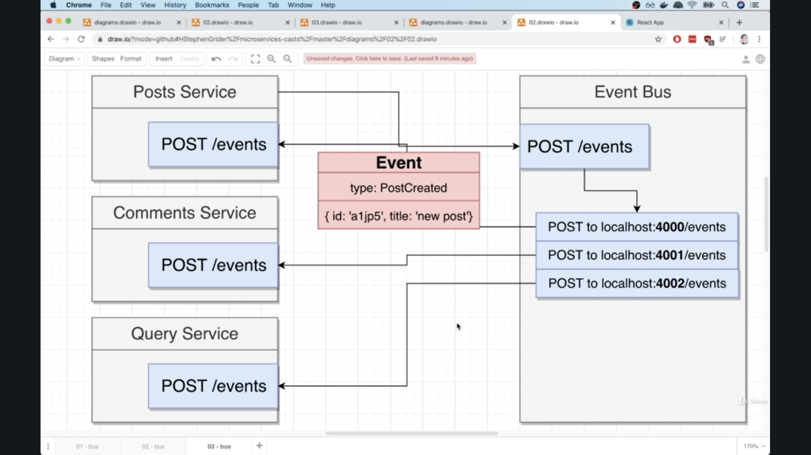

# Mini-Microservice Application

#### Few Notes

1. Goal #1 - Get a taste of a microservices architecture
2. Goal #2 - Build as much as possible from scratch

# What Services should we create?

- For now, we will create one separate service for each resourc in our app.

```javascript
     ----> Create a Post
Posts
     ----> List all Posts


     ----> Create a Comment
Comments
     ----> List all comments
```

# Project Setup


위 사진에서 볼 수 있듯 React App은 Posts Service와 Comments Service와 소통하고 있는 것을 알 수 있다.

### Initial App Setup

- Generate a new React App using Create-React-App
- Create an Express-based project for the **Posts** Service
- Create an Express-based project for the **Comments** Service

```javascript
// blog director

npx create-react-app client

mkdir posts
cd posts
npm init -y
npm i express cors axios nodemon


mkdir comments
cd comments
npm init -y
npm i express cors axios nodemon
```

## Posts Service


## Comments Service


# React Project Setup


## Request Minimization Strategies



Every Single Post가 현재 comments를 GET Method 요청을 하고 있는 것을 확인할 수 있다. 이것은 굉장히 비효율적인 방식이다. 충분히 한 번의 Request 만으로 얻은 comments에 관한 데이터를 가지고 Every Single Post에 데이터를 전달할 수 있다.

위 사진의 경우 comments 데이터를 GET 하는 과정이 세번밖에 되지 않아서 별로 문제 삼지 않을 수 있다. 만약 아래 사진과 같이 10개의 Post가 존재한다고 생각하면 무려 10번이나 불필요한 요청을 만드는 것이다.



Monolith 방식에서는 위 문제를 아래와 같이 쉽게 해결할 수 있다.



Monolithic Server에 query String 방식으로 comments=true로 특별한 신호를 보내주면 Monolithic 서버의 여러 기능들이 comments에 대한 정보를 공유해 사용할 수 있다.

그렇다면 서로 독립적으로 동작하는 microservices 에서는 어떻게 이 문제를 해결할 수 있을까?



Sync Communication 방식은 다음과 같다.

1. GET Request를 Posts Service에게 보낸다.
2. Posts Feature에서 자동으로 Comments Service로 연결되도록 만들어 둔 로직 혹은 함수를 이용해 Request를 만든다
3. 해당 Request를 받은 Comment Service는 응답으로 관련성 있는 Comment를 Posts Service에 전달한다.
4. 처음 단계에서 보낸 Request와 관련한 모든 Comment가 Browser로 전송된다.



Async Communication 방식은 다음과 같다.

Query Service의 역할은 앞서 본 10번의 Request를 한 번으로 줄여주는 것과 같은 효율적인 방식을 제공하는 역할을 한다.



위와 같이

1. POST /posts Request가 발생
2. Posts Service가 Request를 처리하고 처리한 결과를 Event Bus로 전달
3. Event Bus는 Posts Service and Comments Service가 리턴한 결과 값에 항상 관심이 있는 Query Service로 매번 Posts Service or Comments Service가 결과값을 Event Bus로 전달할 때마다 결과값 전송.



위와 같이 Query Service에 생성된 Posts에 관련한 데이터를 최적의 방식으로 저장할 수 있는 구조에 저장하고 그 후에 POST: /posts/:id/comments Request가 발생했을때 Comment Service는 이 요청에 해당하는 결과값을 Event Bus로 리턴하고 그 후 Event Bus는 정의해 둔 로직에 따라 바로 Query Service로 해당 리턴값을 전송해줌으로써 아래와 같이 Posts and Comments를 최적의 방식으로 저장할 수 있는 구조의 Query Service에 저장하게된다.



위와 같은 상태에서 GET /posts 요청시 Posts Service and Comments Service에 요청하지 않고 바로 Query Service에 요청하도록 로직을 작성하면 빠르고 정확하게 모든 Posts 데이터를 응답으로 제공할 수 있다. 앞서 언급했지만 장점은 굉장히 빠르고, zero dependencies라는 것이다. 하지만 단점은 역시 Data Duplication과 동작을 이해하기 어려운 것이다.

### Quick Questions

1. You're saying we need to create a new service every time we need to join some data?

- **Absolutely not! In reality, might not even have posts and comments in separate services in the first place.**

2. Who cares that each service is independent?

- **Independent services + the reliability that brings is one of the core reasons of using microservices in the first place.**

3. This is so over th top complicated for little benefit.

- **Seems that way now! Adding in some features starts to get really easy when we use this architecture**

4. This system won't correctly in the following scenario...

- **There are some very special things we need to consider with this design. I've got solutions for most of the concerns you may have.**

# Event Bus

- Many different implementations. RabbitMQ, Kafka, NATS...
- Receives events, publishes them to listeners
- Many different subtle features that make async communication way easier or way harder
- We are going to build our own event bus using Express. It will not implement the vast majority of features a normal bus has.
- Yes, for our next app we will use a production grade, open source event bus



```javascript
mkdir event-bus
npm init -y
npm i express axios
```
